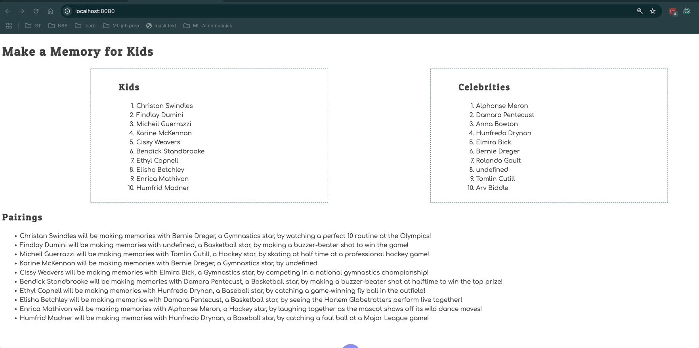

# Events and Debugging Assessment

Time to assess how well you have learned to use the debugging tools in Chrome Dev Tools, and writing click event listeners. This application is to show kids with illnesses and the memories the would like to make. Celebrities sign up to help kids make memories.

> 🧨 Make sure you answer the vocabulary and understanding questions at the end of this document before notifying your coaches that you are done with the project

## Event Listeners to Create

1. When the kid name is clicked, it should display their wish.
1. When the celebrity name is clicked, it should display their sport.
1. The pairings list should should contain the pairing in the following format.
   ```html
   {child name} will be making memories with {celebrity name}, a {celebrity
   sport} star, by {child wish}
   ```

Below is an animation showing how the application should look when complete and how the event listeners should work.



## Setup

Your instruction team will provide a link for you to create your assessment repository. Once your repo is created, clone it to your machine.

1. Make sure you are in your `workspace` directory.
1. `git clone {github repo SSH string}`.
1. `cd` into the directory it creates.
1. `code .` to open the project code.
1. Use the `serve` command to start the web server.
1. Open the URL provided in Chrome.

Make sure your Developer Tools are open at all times while working on this project. Use the messages provided in the Console to determine what code needs to be fixed or implemented, and use breakpoints in the Sources tab to step through your code as you debug.

## Vocabulary and Understanding

Before you click the "Complete Assessment" button on the Learning Platform, add your answers below each question and make a commit.

1. When a child is clicked on in the browser, which module contains the code that will execute on that event happening? Can you explain the algorithm of that logic?

   > The event listener for when a child is clicked is in the **Kids** module. When a click event is detected the event listener will take the target of the click event and check if the dataset type value equals "child." If it is, then an object called clickedKid is created and the dataset values for name and wish are assigned as their respective key values.
   > A window alert message is then created using the clickedKid's key values to input the name and wish.

2. In the **Pairings** module, why must the `findCelebrityMatch()` function be invoked inside the `for..of` loop that iterates the kids array?

   > For each kid of the kidsArray we need to be able to iterate through the celebrities array to see which celebrity is paired with each kid. Running the `findCelebrityMatch()` function inside the `for..of` loop allows us to run one `for..of` inside another.

3. In the **CelebrityList** module, can you describe how the name of the sport that the celebrity plays can be displayed in the window alert text?

   > We can display the name of the sport but using the data attribute of the <li> HTML element.
   By assigning `${celebrity.sport}` to a data attribute we can pull this information later using the click EventListener's target and use it in the window alert text.

4. Can you describe, in detail, the algorithm that is in the `main` module?

   > First the variable mainContainer is created and assigned the value of the HTML element that is under the "container" class.
   Then the variable applicationHTML is created that will have our main HTML string as its value.
   This HTML string is created with two different articles.
   One article has two sections for both the kids and celebrities lists. Each of these sections invoke their respective functions,`Kids()` and `Celebrities()`, which return the HTML string for that list.

   The other article is for our list of pairings. The articles HTML is also created by invoking a function. In this case when the `Pairings()` function is invoked the two arrays containing all the kids and all the celebrities are iterated through with the help of the `findCelebrityMatch()` function. The celebrityId numbers of each kid is compared against each celebrity's ID number. When a match is found the corresponding kid's celebrity is then returned as an object and assigned as the value of the variable kidsStar.
   A <li> element is then added to the HTML variable with the The kid's and kidsStar's information added into the pairing template's placeholders ${} for the needed information.
   Once all kids have been paired the finished <ul> HTML string is then return to main.js.

   The mainContainer's inner HTML is then updated with this finished applicationHTML string to be rendered to the DOM.
